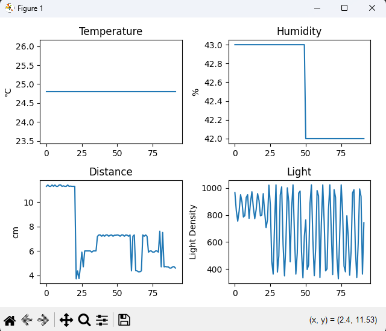
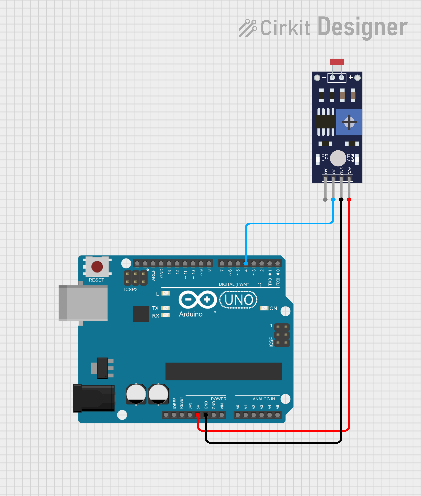

# Smart Sensor Dashboard — Arduino + Python Monitoring System

Real-time environmental monitoring system. An Arduino reads temperature, humidity, distance, and light sensors simultaneously, sends structured CSV data over serial, and a Python dashboard plots all four live while logging to CSV for analysis.

---

## Demo



---

## Hardware

| Component | Purpose |
|-----------|---------|
| Arduino Uno | Microcontroller — reads sensors and sends serial data |
| DHT11 | Temperature (°C) and humidity (%) |
| HC-SR04 | Ultrasonic distance (cm) |
| LDR + 10kΩ resistor | Light intensity (raw ADC 0–1023) |
| Breadboard + jumper wires | Connections |

---

## Wiring

### DHT11


| DHT11 Pin | Arduino Pin |
|-----------|-------------|
| VCC | 5V |
| GND | GND |
| Data | Digital Pin 3 |

---

### HC-SR04 (Ultrasonic)


| HC-SR04 Pin | Arduino Pin |
|-------------|-------------|
| VCC | 5V |
| GND | GND |
| Trig | Digital Pin 9 |
| Echo | Digital Pin 10 |

---

### LDR (Light sensor)



| LDR side | Connection |
|----------|------------|
| One leg | 5V |
| Other leg | Analog Pin A0 + 10kΩ resistor to GND (voltage divider) |

---

## System Architecture

```
Sensors → Arduino (C++) → Serial UART → Python dashboard.py → Live plots + CSV log
                                                                       ↓
                                                              MATLAB analyze_sensors.m
```

---

## Serial Data Format

Arduino sends one CSV line every 200 ms:

```
humidity,temperature,distance,light
44.0,23.8,59.84,805
```

---

## How to Run

**1. Flash the Arduino**

Open `Codes/system/` in PlatformIO and upload to the board.

**2. Install Python dependencies**

```bash
pip install pyserial matplotlib
```

**3. Set your COM port**

Edit line 8 of `Codes/Python/dashboard.py`:

```python
ser = serial.Serial('COM3', 9600)   # change COM3 to your port
```

On Linux/Mac use `/dev/ttyUSB0` or `/dev/ttyACM0`.

**4. Run the dashboard**

```bash
cd Codes/Python
python dashboard.py
```

Close the Arduino Serial Monitor before running — only one program can hold the serial port at a time.

Data is saved automatically to `sensor_log.csv` in the same folder.

---

## Project Structure

```
Smart-Sensor-Dashboard/
├── Codes/
│   ├── system/          ← Combined Arduino code (main project)
│   │   └── src/main.cpp
│   ├── DHT11/           ← Individual sensor test
│   ├── LDR/             ← Individual sensor test
│   ├── Ultrasonic/      ← Individual sensor test
│   └── Python/
│       ├── dashboard.py ← Main script: live plots + CSV logging
│       └── serial_comm.py
├── Data/
│   ├── DTH11 sensor/    ← Datasheet + wiring photo
│   ├── LDR/             ← Datasheet + wiring photo
│   ├── Ultrasonic sensor/ ← Datasheet + wiring photo
│   ├── Screenshots/     ← Dashboard demo screenshot
│   └── sensor_log.csv   ← Example logged data
└── README.md
```

---

## What I Learned

- Interfacing DHT11, HC-SR04, and LDR simultaneously on Arduino
- Structuring embedded C++ using structs and functions — clean `loop()` with no raw globals
- Serial UART communication and CSV-formatted data framing
- Python `pyserial` for reading serial data
- Matplotlib `FuncAnimation` for real-time plotting without blocking
- `collections.deque` with `maxlen` for a rolling window of data
- Python `csv` module and `datetime` for timestamped data logging

---

## Future Improvements

- MATLAB `analyze_sensors.m` — statistical analysis of logged CSV data
- Signal filtering (moving average on noisy distance readings)
- GUI dashboard using PyQt or Tkinter
- Wireless communication via ESP32
- ROS2 integration as a sensor node

---

## Author

Ahmed Shalash — Mechatronics Engineer | Robotics & Automation